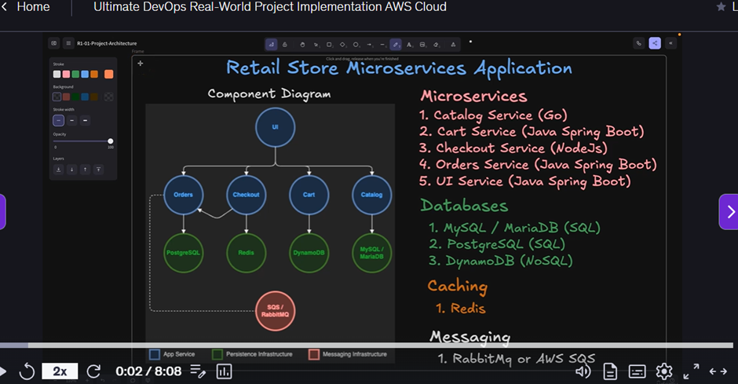

Section: 1
Intro of  Retail store application: 
 

Section 2 : Docker Command

Docker Concepts Covered  :
 

Create EC2 Instance and Install Docker:

1. Launch EC2 Instance
Use the AWS Console to launch a new EC2 instance.
2. Connect via SSH
ssh -i your-key.pem ec2-user@<your-ec2-public-ip>
 
________________________________________
3. Install Docker on Amazon Linux 2023
sudo dnf update -y
sudo dnf install docker -y
sudo systemctl enable docker
sudo systemctl start docker
sudo usermod -aG docker ec2-user

 

 

# Check Docker version
docker version
 
# List Docker images (should be empty initially)
docker images
# Run a test container
docker run hello-world
# List images again (should now include hello-world)
docker images
 

docker ps : Docker all currently running containers
docker ps -a : list all contanier Which is running and stopped
docker ps  -aq  : it will give container id 
docker rm  $( docker ps  -aq  ) : it will removed stopped container
docker rmi :  Delated images 
docker  images  -q : gives image id 

 

 

Pull and Run Docker Images from Docker Hub and Run
 

# Pull Docker image from Docker Hub
docker pull stacksimplify/retail-store-sample-ui:1.0.0
# Alternatively, pull from GitHub Packages (no download limits)
docker pull ghcr.io/stacksimplify/retail-store-sample-ui:1.0.0
# List Docker images to confirm the image is pulled
docker images
 

Run the Downloaded Docker Image
•	HOST_PORT: The port number on your host machine where you want to receive traffic (e.g., 8888).
•	CONTAINER_PORT: The port number within the container that's listening for connections (e.g., 8080).
# Run Docker Container
docker run --name <CONTAINER-NAME> -p <HOST_PORT>:<CONTAINER_PORT> -d <IMAGE_NAME>:<TAG>
 
 

Connect to Docker Container Terminal
docker exec -it <CONTAINER-NAME> /bin/sh
# Inside the container, you can run the following commands:
## Basic OS Info
uname -a                    # Kernel version and system details
cat /etc/os-release         # Check base OS details
whoami                      # See current user (usually 'root')
## File System + App Structure
pwd                         # Current directory (usually /)
ls                          # List files
ls -l /app                  # Check where app.jar is located (if /app is used)
## Java Runtime
java -version               # Verify Java is installed and check version
## Test Application (from inside container - Container port 8080)
curl http://localhost:8080  # Send a request to the app running inside
## Exit container shell
exit 
 

 Stop and Start Docker Containers
stop a running container
docker stop <CONTAINER-NAME>
# Start the stopped container
docker start <CONTAINER-NAME>
 
remove the container
docker rm <CONTAINER-NAME>
#  stop and remove the container in one command
docker rm -f <CONTAINER-NAME>
docker rm -f myapp1
 
 
Section: 1
Intro of  Retail store application: 
 

Section 2 : Docker Command

Docker Concepts Covered  :
 

Create EC2 Instance and Install Docker:

1. Launch EC2 Instance
Use the AWS Console to launch a new EC2 instance.
2. Connect via SSH
ssh -i your-key.pem ec2-user@<your-ec2-public-ip>
 
________________________________________
3. Install Docker on Amazon Linux 2023
sudo dnf update -y
sudo dnf install docker -y
sudo systemctl enable docker
sudo systemctl start docker
sudo usermod -aG docker ec2-user

 

 

# Check Docker version
docker version
 
# List Docker images (should be empty initially)
docker images
# Run a test container
docker run hello-world
# List images again (should now include hello-world)
docker images
 

docker ps : Docker all currently running containers
docker ps -a : list all contanier Which is running and stopped
docker ps  -aq  : it will give container id 
docker rm  $( docker ps  -aq  ) : it will removed stopped container
docker rmi :  Delated images 
docker  images  -q : gives image id 

 

 

Pull and Run Docker Images from Docker Hub and Run
 

# Pull Docker image from Docker Hub
docker pull stacksimplify/retail-store-sample-ui:1.0.0
# Alternatively, pull from GitHub Packages (no download limits)
docker pull ghcr.io/stacksimplify/retail-store-sample-ui:1.0.0
# List Docker images to confirm the image is pulled
docker images
 

Run the Downloaded Docker Image
•	HOST_PORT: The port number on your host machine where you want to receive traffic (e.g., 8888).
•	CONTAINER_PORT: The port number within the container that's listening for connections (e.g., 8080).
# Run Docker Container
docker run --name <CONTAINER-NAME> -p <HOST_PORT>:<CONTAINER_PORT> -d <IMAGE_NAME>:<TAG>
 
 

Connect to Docker Container Terminal
docker exec -it <CONTAINER-NAME> /bin/sh
# Inside the container, you can run the following commands:
## Basic OS Info
uname -a                    # Kernel version and system details
cat /etc/os-release         # Check base OS details
whoami                      # See current user (usually 'root')
## File System + App Structure
pwd                         # Current directory (usually /)
ls                          # List files
ls -l /app                  # Check where app.jar is located (if /app is used)
## Java Runtime
java -version               # Verify Java is installed and check version
## Test Application (from inside container - Container port 8080)
curl http://localhost:8080  # Send a request to the app running inside
## Exit container shell
exit 
 

 Stop and Start Docker Containers
stop a running container
docker stop <CONTAINER-NAME>
# Start the stopped container
docker start <CONTAINER-NAME>
 
remove the container
docker rm <CONTAINER-NAME>
#  stop and remove the container in one command
docker rm -f <CONTAINER-NAME>
docker rm -f myapp1
 
 
